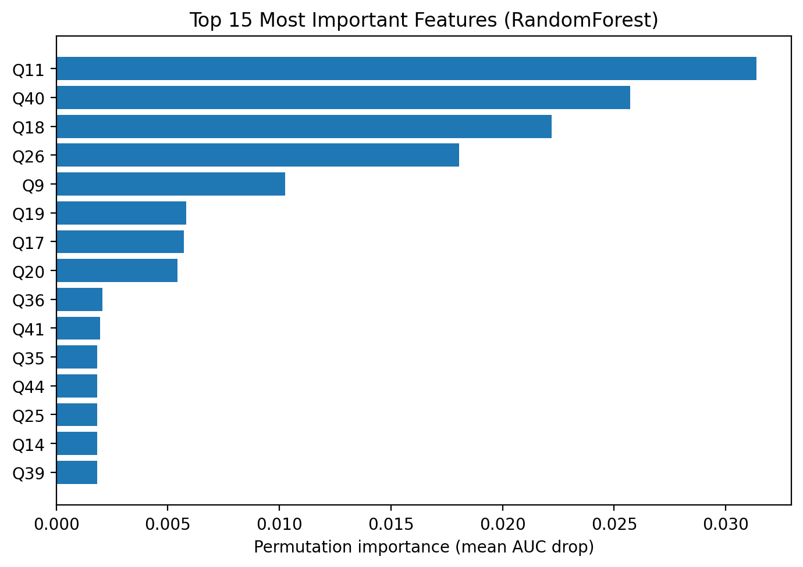

# Identifying Factors Affecting Muslim Marriage Success (Data Science Project)

This repository contains an end-to-end data science project exploring factors associated with Muslim marriage success.  
It includes **exploratory data analysis (EDA)**, classical machine learning models, and a **Streamlit app** for interactive visualization and prediction.

> **Ethics Disclaimer**: This project is for **educational purposes only**.  
> Do not use the models here for real-world counseling or high-stakes decisions.  
> Always anonymize personal data and follow your institution’s research ethics guidelines.

---

## Repository Structure
```
.
├── app/ # Streamlit app
│ └── app.py
├── data/ # Input datasets
│ ├── divorce_data.csv
│ ├── primary_survey.csv
│ └── sample_divorce_data.csv
├── models/ # Trained model artifacts
│ ├── model.pkl
│ └── model.features.json
├── notebooks/ # Jupyter notebooks for analysis
│ ├── 01_primary_survey_eda_model.ipynb
│ └── 02_divorce_predictors_kaggle_eda_model.ipynb
├── reports/ # Results, metrics, figures
│ ├── cv_rf_vs_lr.txt
│ ├── feature_importance.png
│ └── metrics_summary.md
├── scripts/ # Training & evaluation scripts
│ ├── train_model.py
│ └── evaluate_model.py
├── src/ # Utility functions
│ └── utils.py
├── requirements.txt # Dependencies
└── README.md # Project documentation
```

## Quickstart (Local)

1. **Create environment & install deps**
   ```bash
   python -m venv .venv
   # Activate the environment
   # On Windows:
   .venv\Scripts\activate
   # On Mac/Linux:
   source .venv/bin/activate

   # Install dependencies
   pip install -r requirements.txt
   ```

2. **Add data**
   - Place divorce_data.csv into the data/ folder.
   - (Optional) Place your primary_survey.csv file into data/ as well.
   - A small sample_divorce_data.csv is included for quick testing.

3. **Train a baseline model**
   ```bash
   python scripts/train_model.py --data data/divorce_data.csv --target Divorce --out models/model.pkl
   ```

4. **Run the app**
   ```bash
   streamlit run app/app.py
   ```

## Result

We evaluated two baseline models using 5-fold Stratified Cross Validation on the Kaggle Divorce Predictors dataset:

- **RandomForest (300 trees)** performs slightly better overall than **Logistic Regression**.
- Both models achieve very high ROC AUC (≥ 0.99), which is expected on this dataset.

See the full table here → [`reports/metrics_summary.md`](reports/metrics_summary.md).

## Interpretability (Permutation Importance)

We computed **permutation importance** on a held-out test set to see which questions influence predictions most for the RandomForest model. The chart below shows the top features by the average decrease in ROC AUC when each feature is randomly shuffled (higher = more influential).



> Notes:
> - Importance is measured relative to this dataset/model — not causal.
> - Correlated questions can share importance (shuffling one may be partly “covered” by another).
> - This project is for **educational** use; do not use for counseling decisions.

## Deployment (Streamlit Cloud)

1. Push this repo to GitHub (public or private).
2. On [Streamlit Community Cloud], create a new app from your repo, set main file to `app/app.py`.
3. Add `data/divorce_data.csv` via Secrets or upload at runtime from the app.

## Notes

- The app supports two modes: **EDA** (load CSV and explore) and **Predict** (uses a saved model + feature template).
- Trained artifacts (`models/`) and raw data (`data/`) are `.gitignore`'d by default.
- See `scripts/evaluate_model.py` for reproducible CV and metrics export.
